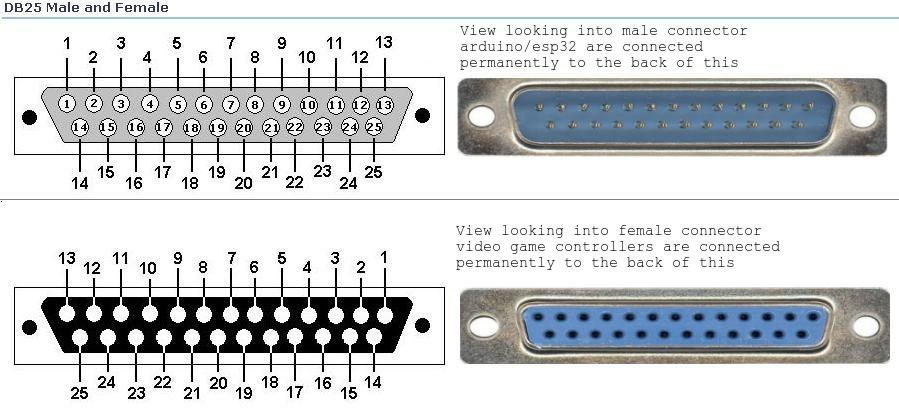

OpenRetroPad
------------

Adapt various input devices to various output devices.

Currently supported inputs: SNES/NES, Sega Genesis/Megadrive/Atari, Playstation (and PS2) Digital and Dual shock, Nintendo 64, Nintendo Gamecube

Currently supported outputs: bluetooth-hid gamepad, usb-hid gamepad, nintendo switch usb gamepad, wireless usb-hid gamepad over radio

Build using [PlatformIO](https://platformio.org/) using `pio run` or `pio run -e $board-$input-$output` for a specific target/env.

env's are laid out like `$board-$input-$output`
supported values:
  * $board: micro, esp32
  * $input: snes, genesis, psx, n64, gc, radio, debug
  * $output: radio, usb, usbradio, switchusb, bt, debug
  * please note not all boards are compatible with all inputs/outputs, for example esp32 can only do bt, micro can only do radio or usb

Wiring
------

(quick plea: if you are good at drawing diagrams, please help!)

| DB-25 Pins    | Arduino Pro Micro GPIO | ESP32 GPIO | Radio    | SNES   | PSX    | N64      | Gamecube | Genesis     |
|---------------|------------------------|------------|----------|--------|--------|----------|----------|-------------|
|  1            |  1                     | 15         | -        | -      | -      | -        | -        | P1-1        |
|  2            |  2                     |  2         | -        | LATCH  | DATA   | DATA1    | DATA1    | P1-3        |
|  3            |  3                     |  4         | -        | CLOCK  | CMD    | -        | -        | P1-4        |
|  4            |  4                     | 16         | -        | -      | ATT    | -        | -        | P1-6        |
|  5            |  5                     | 17         | -        | -      | CLK    | -        | -        | P1-7        |
|  6            |  6                     |  5         | -        | -      | -      | -        | -        | P1-9        |
|  7            |  7                     | 18         | CE       | -      | -      | -        | -        | P2-7*       |
|  8            |  8                     | 19         | CSN      | -      | -      | -        | -        | -           |
|  9            |  9 > 1k Ω              | 35 > 1k Ω  | -        | 330 Ω  | 100 Ω  | 220 Ω    | 680 Ω    | 470 Ω       |
| 10            | 10                     |  3         | -        | -      | -      | -        | -        | -           |
| 11            |  0                     |  1         | -        | -      | -      | -        | -        | P1-2        |
| 12            | -                      | 22         | -        | -      | -      | -        | -        | -           |
| 13            | -                      | 23         | -        | -      | -      | -        | -        | -           |
| 14            | 14                     | 12         | MISO     | -      | -      | -        | -        | P2-6*       |
| 15            | 15                     | 14         | SCLK     | -      | -      | -        | -        | P2-9*       |
| 16            | 16                     | 13         | MOSI     | -      | -      | -        | -        | -           |
| 17            | -                      | 27         | -        | -      | -      | -        | -        | -           |
| 18            | 18                     | 26         | -        | DATA1  | -      | -        | -        | P2-1        |
| 19            | 19                     | 25         | -        | DATA2  | -      | -        | -        | P2-2        |
| 20            | 20                     | 33         | -        | DATA3  | -      | -        | -        | P2-3        |
| 21            | 21                     | 32         | -        | DATA4  | -      | -        | -        | P2-4        |
| 22            | -                      | -          | -        | -      | -      | -        | -        | -           |
| 23            | -                      | 3.3V VCC   | 3.3V VCC | -      | -      | 3.3V VCC | 3.3V VCC | -           |
| 24            | 5V VCC OUT             | 5V VCC     | 5V VCC   | 5V VCC | 5V VCC | -        | 5V VCC   | PX-5 5V VCC |
| 25            | GND                    | GND        | GND      | GND    | -      | GND      | GND      | PX-8 GND    |

* 2nd player Genesis is incompatible with Radio because it uses the same pins, 1 player Genesis is compatible
Ω This is optional and only used for dongle detection. For DB-25 pin 9: On the micro, run to pin 9 to 5V VCC with a 1k resistor. On ESP32, run to pin 35 to 3.3V VCC with a 1k resistor.  On each dongle, run a resistor of the given value between DB-25 pin 9 and GND.

Credits / Links
---------------

Code and/or inspiration was (or will be) taken from these places, in no particular order:

  * [ESP32-BLE-Gamepad](https://github.com/lemmingDev/ESP32-BLE-Gamepad)
  * [DaemonBite-Retro-Controllers-USB](https://github.com/MickGyver/DaemonBite-Retro-Controllers-USB)
  * [Arduino-USB-HID-RetroJoystickAdapter](https://github.com/mcgurk/Arduino-USB-HID-RetroJoystickAdapter)
  * [BlueCubeMod](https://github.com/NathanReeves/BlueCubeMod)
  * [OpenSwitchPad](https://github.com/agustincampeny/OpenSwitchPad)
  * [arduino-n64-controller-library](https://github.com/pothos/arduino-n64-controller-library)
  * [N64toiQue](https://github.com/mnzlmstr/N64toiQue)
  * [dreamcast_usb](https://github.com/raphnet/dreamcast_usb)
  * [SNES-NRF24](https://github.com/baldengineer/SNES-NRF24)
  * https://github.com/NicoHood/Nintendo
  * https://github.com/darthcloud/BlueRetro
  * https://github.com/raphnet/gc_n64_usb-v3
