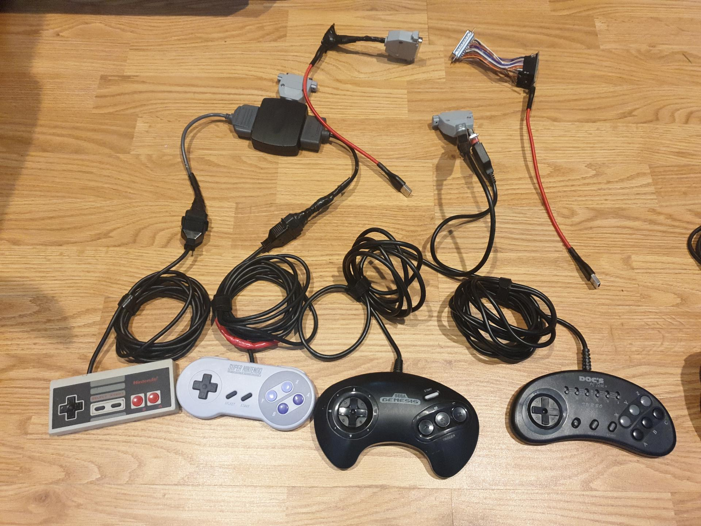
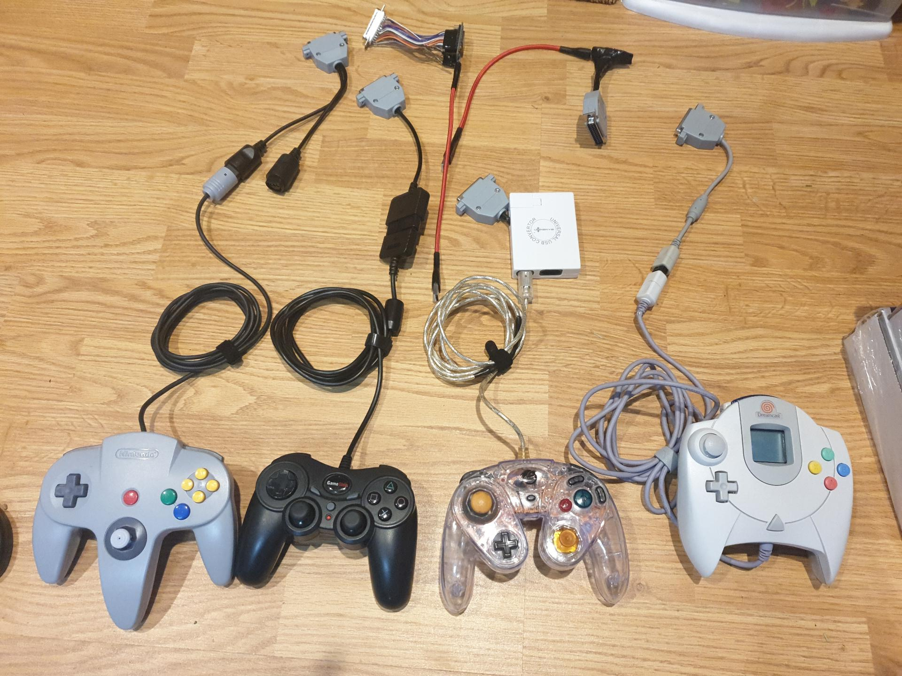

OpenRetroPad
------------

Adapt various input devices to various output devices.

Currently supported inputs: SNES/NES, Sega Genesis/Megadrive/Atari, Playstation (and PS2) Digital and Dual shock, Nintendo 64, Nintendo Gamecube

Currently supported outputs: bluetooth-hid gamepad, usb-hid gamepad, nintendo switch usb gamepad, wireless usb-hid gamepad over radio

OpenRetroPad is written and tested on an Arduino Pro Micro and an ESP32, there is also an in-progress custom PCB being developed at [OpenRetroPadHW](https://github.com/OpenRetroPad/OpenRetroPadHW)

Build using [PlatformIO](https://platformio.org/) using `pio run` or `pio run -e $board-$input-$output` for a specific target/env.

env's are laid out like `$board-$input-$output`
supported values:
  * $board: micro, esp32
  * $input: snes, genesis, psx, n64, gc, radio, debug
  * $output: radio, usb, usbradio, switchusb, bt, debug
  * please note not all boards are compatible with all inputs/outputs, for example esp32 can only do bt, micro can only do radio or usb

Pics
----

My controllers and adapters I used to build+test this (and play with, of course!)

Wiring
------

(quick plea: if you are good at drawing diagrams, please help!)

| DB-25 Pins    | Arduino Pro Micro GPIO | ESP32 GPIO | Radio    | SNES    | PSX    | N64      | Gamecube | Genesis     | Dreamcast |
|---------------|------------------------|------------|----------|---------|--------|----------|----------|-------------|-----------|
|  1  TX        |  1                     | 19         | -        | LATCH   | -      | -        | -        | P1-1        | P1-DATA1  |
|  2  SDA       |  2                     | 21         | -        | CLOCK   | DATA   | P1-DATA  | P1-DATA  | P1-3        | P1-DATA5  |
|  3  SCL       |  3                     | 22         | -        | P1-DATA | CMD    | -        | -        | P1-4        | -         |
|  4  Analog    |  4                     | 15         | -        | P2-DATA | ATT    | -        | -        | P1-6        | -         |
|  5  Digital   |  5                     | 16         | -        | P3-DATA | CLK    | -        | -        | P1-7        | -         |
|  6  Analog    |  6                     |  2         | -        | P4-DATA | -      | -        | -        | P1-9        | -         |
|  7  Digital   |  7                     | 17         | CE       | -       | -      | -        | -        | P2-7*       | -         |
|  8  Analog    |  8                     |  4         | CSN      | -       | -      | -        | -        | -           | -         |
|  9  Analog    |  9 > 1k Ω              | 35 > 1k Ω  | -        | 330 Ω   | 100 Ω  | 220 Ω    | 680 Ω    | 470 Ω       | 820 Ω     |
| 10  Analog    | 10                     | 32         | -        | -       | -      | -        | -        | -           | -         |
| 11  RX        |  0                     | 18         | -        | -       | -      | -        | -        | P1-2        | -         |
| 12  -         | -                      | -          | -        | -       | -      | -        | -        | -           | -         |
| 13  -         | -                      | -          | -        | -       | -      | -        | -        | -           | -         |
| 14  MISO      | 14                     | 12         | MISO     | -       | -      | -        | -        | P2-6*       | -         |
| 15  SCLK      | 15                     | 14         | SCLK     | -       | -      | -        | -        | P2-9*       | -         |
| 16  MOSI      | 16                     | 13         | MOSI     | -       | -      | -        | -        | -           | -         |
| 17  -         | -                      | -          | -        | -       | -      | -        | -        | -           | -         |
| 18  Analog    | 18                     | 27         | -        | -       | -      | -        | -        | P2-1        | -         |
| 19  Analog    | 19                     | 26         | -        | -       | -      | -        | -        | P2-2        | -         |
| 20  Analog    | 20                     | 25         | -        | -       | -      | -        | -        | P2-3        | -         |
| 21  Analog    | 21                     | 33         | -        | -       | -      | -        | -        | P2-4        | -         |
| 22  -         | -                      | -          | -        | -       | -      | -        | -        | -           | -         |
| 23  3.3V VCC  | -                      | 3.3V VCC   | 3.3V VCC | -       | -      | 3.3V VCC | 3.3V VCC | -           | -         |
| 24  5V VCC    | 5V VCC OUT             | 5V VCC     | 5V VCC   | 5V VCC  | 5V VCC | -        | 5V VCC   | PX-5 5V VCC | 5V VCC    |
| 25  GND       | GND                    | GND        | GND      | GND     | -      | GND      | GND      | PX-8 GND    | GND       |

* 2nd player Genesis is incompatible with Radio because it uses the same pins, 1 player Genesis is compatible
Ω This is optional and only used for dongle detection. On the microcontroller side, put a 1k resistor between DB-25 pin 9 and VCC (3.3v for ESP32, 5V for Micro). On each controller dongle, put a resistor of the given value between DB-25 pin 9 and GND.

All connected pins can also function as Digital pins.

Credits / Links
---------------

Code and/or inspiration was (or will be) taken from these places, in no particular order:

  * [ESP32-BLE-Gamepad](https://github.com/lemmingDev/ESP32-BLE-Gamepad)
  * [DaemonBite-Retro-Controllers-USB](https://github.com/MickGyver/DaemonBite-Retro-Controllers-USB)
  * [Arduino-USB-HID-RetroJoystickAdapter](https://github.com/mcgurk/Arduino-USB-HID-RetroJoystickAdapter)
  * [BlueCubeMod](https://github.com/NathanReeves/BlueCubeMod)
  * [OpenSwitchPad](https://github.com/agustincampeny/OpenSwitchPad)
  * [arduino-n64-controller-library](https://github.com/pothos/arduino-n64-controller-library)
  * [N64toiQue](https://github.com/mnzlmstr/N64toiQue)
  * [dreamcast_usb](https://github.com/raphnet/dreamcast_usb)
  * [SNES-NRF24](https://github.com/baldengineer/SNES-NRF24)
  * https://github.com/NicoHood/Nintendo
  * https://github.com/darthcloud/BlueRetro
  * https://github.com/raphnet/gc_n64_usb-v3
